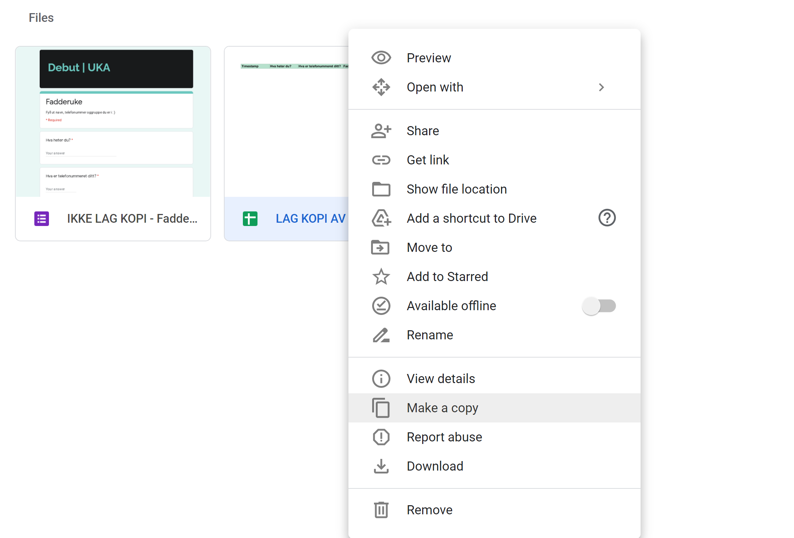
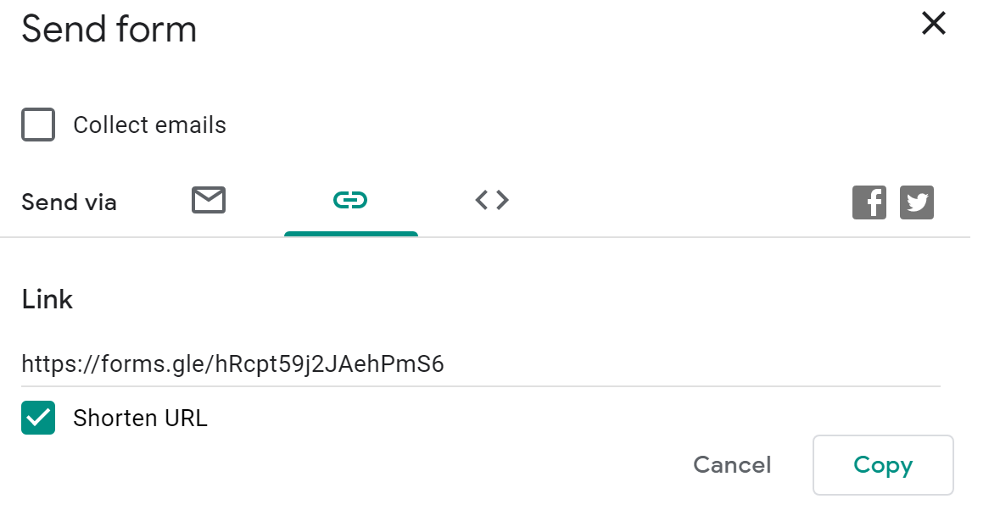

# Smittesporing-fadderuke-2021 NT-Fakultetet

Dette er en smart måte å smittespore på. Dersom alt er satt opp korrekt er det eneste deltakerne trenger å skanne en QR-kode, og deretter fylle ut en Google Forms. Alt  fra Google Formen logges automatisk til ett korresponderende Google Sheets dokument - hvor tidspunkt automatisk føres. Dette gjør at man mye lettere kan bidra til en trygg og hyggelig fadderuke for alle og en hver :)

***

## Anbefaling

Jeg anbefaler hver faddergruppe lage en delt Google Drive mappe. Hva man skal legge her kommer senere. - Dette gjør at alle faderne har tilgang til smittesporingen.

### [Her er en Youtube guide, for dere som ikke er kjent med README](https://www.youtube.com/watch?v=kYllTxe7IWc)

***

## Google Driven

[Her er linken til google driven](https://drive.google.com/drive/folders/13Nz_qdJQJ0LuAT22RWGcbdz2Wcp7dt-g?usp=sharing)
**NBNB!! Husk å velge mappen for ditt studie!!**

Når du kommer til mappen vil du se en rekke mapper, velg mappen for studiet ditt.
\
Inni mappen for studiet ditt vil du se to ting:

* Ett Google Sheets dokument **dette blir viktig senere**
* Ett Google Forms dokument

## Google Sheets (den grønne)

Høyre klikk på Google Sheets, og velg kopier, se bilde:

<!--  -->

Når dette er gjort, så kan du gå ut av mappen. Og du vil da kunne se en kopi av både Google Sheets og Google Forms dokumentene.

**NBNB! Før du legger disse i mappa for din faddergruppe, må du sjekke om det står kopi på slutten av navnet dens**
\
\
Dersom det gjør det, kan du forandre navnet på dokumentene og legge det inn i **deres** mappe :)

## Google Forms (den lilla)

For å få tak i linken til Google Formsen, må dere:

1. Åpne Google forms dokumentet
2. Klikk send (se bilde) **NB! Velg link her**
3. Forkort, og kopier linken.

<!--  -->

## QR-kode

[Dette er den beste siden for å generere QR-koder](https://www.the-qrcode-generator.com/?fbclid=IwAR3-ooFtp3fp4JZzhoWmv5YSKJ_SHI7mzos5brqc9xvRMwiC8YHh3f8OHKc)
**NBNB! Husk å velge URL, dette er svært viktig**
\
Du kan nå lagre bildet som *png*, kan være lurt å gi den ett lurt navn som f.eks. *QR-nt8*

## Arrangement/møte

Det kan være veldig lurt å lage ett Google Doc dokument, dere legger inn i **deres** egen mappe. Her kan dere sette in QR-koden. Dette dokumentet kan skrives ut og tatt med på hver aktivitet dere skal på.
\
\
I tillegg anbefaler jeg på det høyeste at hver fadder lagrer QR-koden på mobilen slik at man alltid har den lett tilgjengelig.
\
\
Når dere skal møte fadderungene deres er det bare å for de å skanne QR-koden, det kan også være lurt å ha linken tilgjengelig, dersom noen ikke har smarttelefon (da må du som fadder føre det inn), eller dersom fadderungen ikke har QR-kode skanner tilgjengelig. 

***

### Spørsmål?

[Link til FAQ](https://github.com/noramold/Smittesporing-fadderuke-2021/blob/main/FAQ.md)
\
Har dere noen spørsmål er det bare sende de til meg på Messenger (Nora Moldestad). \
Kan også kontaktes på epost: [nmo025@post.uit.no](mailto:nmo025@post.uit.no)
\
Ha en trygg og god fadderuke
\

